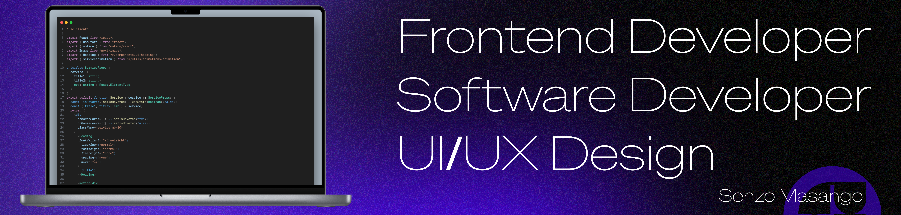

I'm Senzo Masango a  **software developer** specializing in **web development** and **​front-end engineering**​. I aim to craft visually engaging, intuitive, and high-performance web experiences with a strong focus on both design and functionality.

My mission? To build clean, user-friendly interfaces that not only look great but feel great to use. I'm always learning and staying on top of the latest trends, tools, and **best practices** in tech because this field never stands still, and neither do I.

When I'm not coding, you'll probably find me drawing or ​making music​. There's nothing quite like the thrill of bringing an idea to life, whether it's through code, art, or sound.

 

 

    
    
    
    
              
    

    
   
    
  <h3>Frameworks</h3>
    

    
    
     
      
    

    
   
    
  <h3>Databases</h3>
    

    
    
     
    

    
   
    
  <h3 align="left">CSS Frameworks</h3> 
    

    
    
    
    

